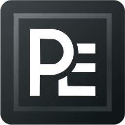
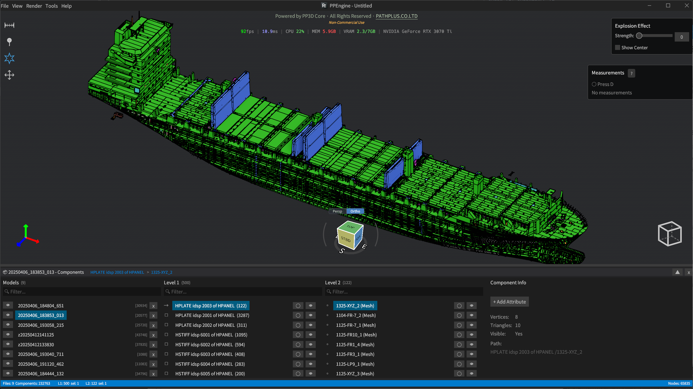
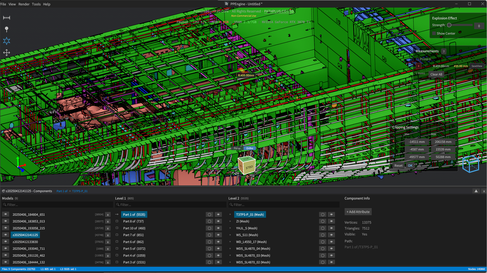
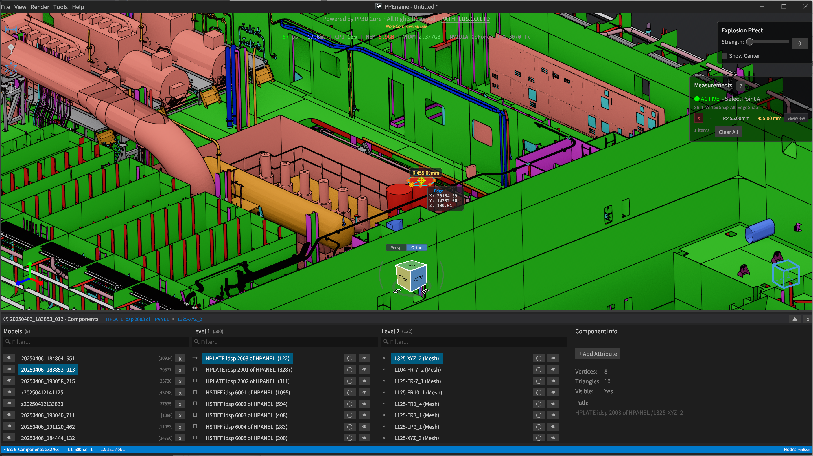
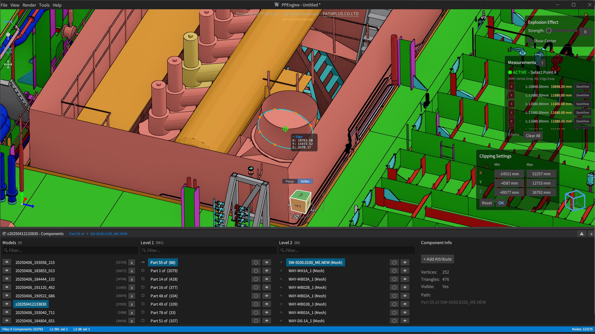
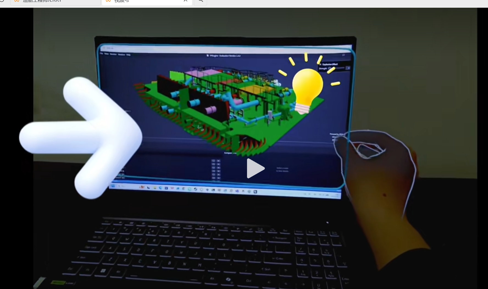
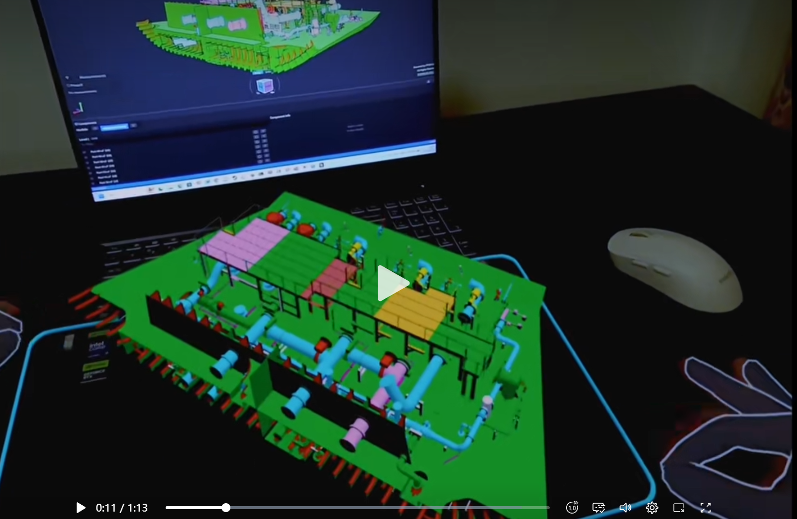
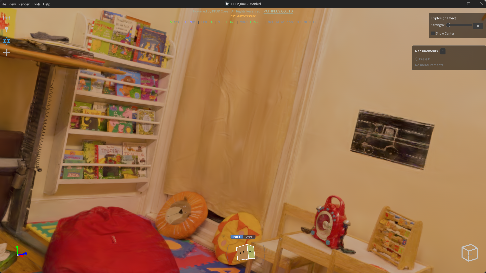
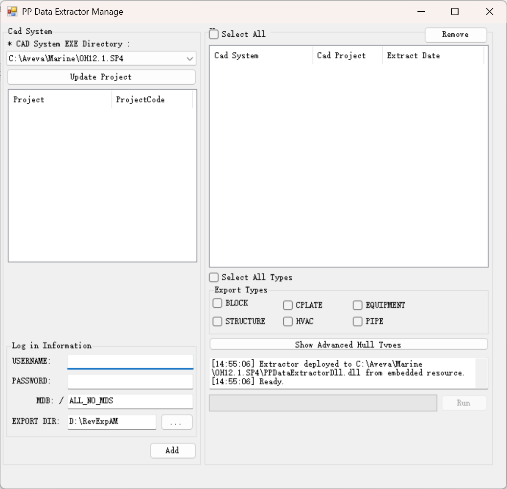
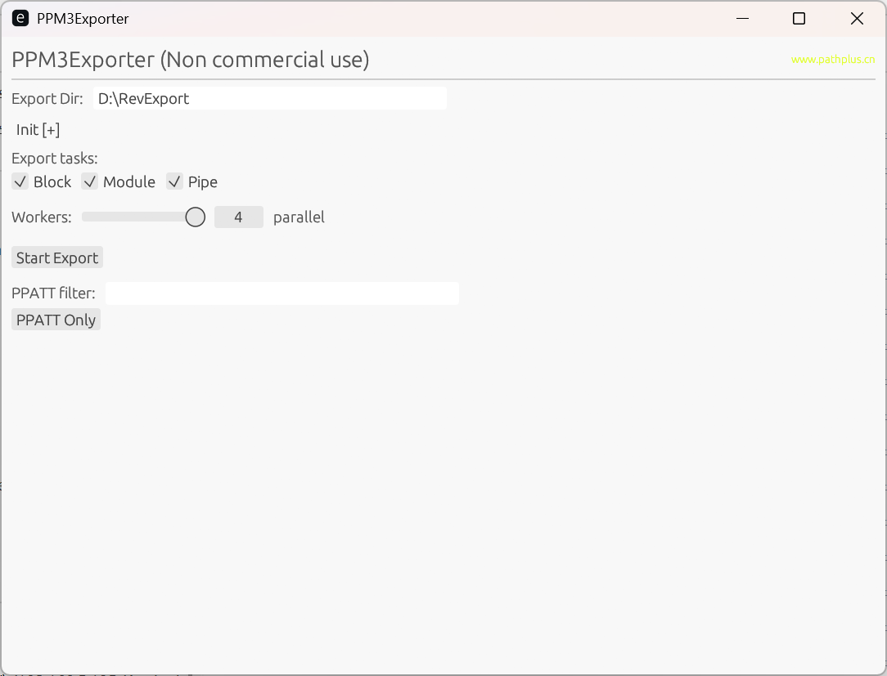

# ✦ PPEngine ✦

### 🚢 专业模型评审器 &nbsp;+&nbsp; 🧠 PP3D 图形内核

*为 **船舶建造 · 海洋工程 · 工厂设计** 而生 —— 全平台 · 高性能 · 生产级验证*

**支持格式：** &nbsp;`REV` &nbsp;·&nbsp; `RVM` &nbsp;·&nbsp; `STEP` &nbsp;·&nbsp; `3D 高斯溅射`

 

**🌐 Language:** &nbsp; [English](README.md) &nbsp;·&nbsp; **简体中文**

 

 

[🎬 简介](#-1-简介) •
[🖼️ 效果展示](#-2-整船效果) •
[📐 测量](#-3-测量与检查) •
[🕶️ XR / VR](#-4-xr--vr-沉浸式评审) •
[✦ 3DGS](#-5-3d-高斯溅射) •
[🗂️ 工作区](#-6-工作区管理) •
[🔌 提取插件](#-7-提取插件) •
[📖 操作手册](#-8-操作手册) •
[📬 联系我们](#-9-联系我们)

 

### 📥 下载

**所有程序 —— 查看器、AM 提取器、Tribon M3 提取器以及操作手册 —— 都可以在 [GitHub Releases 页面](../../releases) 下载。**

下载下面的 `.7z` 压缩包即可直接使用：

| 📦 压缩包 | 📝 内容 |
| :-- | :-- |
| 🎨 `PPEngineV1.8.5.7z` | PPEngine 查看器 **+ 操作手册** |
| 🧲 `PPAMExtractor.7z` | AM 提取插件 |
| 🛳️ `PPM3Exporter.7z` | Tribon M3 提取插件 |

---

## 🎬 1. 简介

PPEngine 实际上是**两样东西捆绑发布**：

| | 产品 | 是什么 |
| :-- | :-- | :-- |
| 🚢 | **PPEngine** —— *专业模型评审器* | 聚焦的免费桌面 + 网页应用，负责大规模工业模型的轻量化转换、查看、数字化交付与**设计评审**。当前支持 **`REV` · `RVM` · `STEP` · `3D 高斯溅射`** 格式。专为**船舶建造、海洋工程与工厂设计**打造。 |
| 🧠 | **PP3D Core** —— *图形内核* | PPEngine 底层的自研跨平台图形内核。一层可授权的引擎/SDK，可嵌入、可扩展 —— 提供全面的 API，按需定制开发。 |

> 一句话：**PPEngine 是你今天就能用上的产品；PP3D Core 是你明天可以基于它构建自己产品的底座。**

> 🛠️ **从图形底层重新自研 —— 没有黑盒。**
> PP3D Core **从图形 API 层开始完全自主实现** —— 每一个渲染 pass、每一块缓冲布局、每一次 GPU dispatch 都是我们自己的代码。**不套用任何第三方游戏引擎，也不是在现成 CAD 内核上打补丁**。这就是为什么我们能压榨出现成查看器达不到的性能，也能按需定制管线中的**任何一环**。

> 🌍 **真·全平台 —— 一套引擎，每个设备。**
> **原生 PC (Windows) · Linux · Android · iOS · Web** —— 同一套引擎、同一份场景、同样的功能。
> 🎮 **全平台现代图形 API：** 原生端跑 **DX12 / Vulkan**，Web 端跑 **WebGPU**，另外**原生一流支持 OpenXR 渲染**，可直接用于沉浸式 VR / AR 设计评审 —— 没有老代码路径，不向最低公分母妥协。*（如必须使用 WebGL 可[联系我们](#-9-联系我们)。）*
> Web 端尤其夸张：我们用**引擎层自研的内存架构绕过了浏览器的 V8 内存上限**，让一艘**10 GB 级的整船模型也能在浏览器里加载并渲染** —— 传统 WebGL 查看器远远达不到这个量级就先崩了。

> 📦 **开放 SDK —— 🚧 积极开发中。**
> PP3D Core 的公共 SDK 正在路上 —— 把引擎嵌入你自己的应用、扩展管线、脚本化业务逻辑、在任何受支持的平台发布定制查看器。如果想提前拿到内测或参与塑造 API 形态，欢迎[联系我们](#-9-联系我们)。

PPEngine 常用于从 **Tribon / AM / SPD / CATIA** 软件中提取模型与属性信息，通过专用转换服务器实时生成轻量化模型，方便用户快速查看、批注与记录。

### ⚡ 性能一览

| 指标                     | 结果                             |
| :---------------------- | :------------------------------- |
| 📦 源模型规模             | **~10 GB** REV / RVM             |
| ⏱️ 轻量化加载时间          | **~5 秒**（中端配置 PC）         |
| 🎞️ 显示帧率               | **~60 fps**                     |
| 🌐 支持平台               | Windows · Linux · Web · Android · iOS · VR/AR |

> 💡 **提示** —— 联系我们获取免费的 **Tribon / AM** 服务器数据提取软件，让团队实时探索轻量化模型，省下转换开销。

### 🚀 极致优化的 GPU 管线

> PP3D Core 的每一个渲染阶段都是 **GPU 优先** 的 —— CPU 只负责调度，GPU 负责干重活。这就是我们能在中端硬件上让 **10 GB 级模型跑到 60 fps** 的原因。

| 🔥 特性 | 💬 带来的价值 |
| :-- | :-- |
| 🎯 **GPU 拾取** | 像素级精准选择完全在 GPU 上完成 —— 零 CPU 射线检测，无论场景多复杂都是常数时间 |
| ✂️ **GPU 视锥剔除** | 每帧在 GPU 上逐实例计算可见性 —— 看不见的几何永远不会进光栅化 |
| 🫥 **GPU 遮挡剔除** | GPU 上做层级 Z-buffer 遮挡查询 —— 被船体、舱壁、密集设备挡住的零件完全跳过，哪怕在视锥内也不画 |
| 📦 **GPU 驱动 Indirect Draw** | 绘制命令由 GPU 自己生成，把**数百万个零件**压缩成寥寥几次 `DrawIndirect` 调用 |
| 🛰️ **超低延迟远程串流** | 云游戏式像素串流 —— 引擎以 **headless 模式** 跑在高性能服务器上，把渲染帧串流给任何瘦客户端（笔电 · 平板 · 手机 · 浏览器）。可实现**多客户端并发 1080p @ 60 fps**，延迟低到**使用体验与本机运行几乎无差距**。10 GB 模型留在服务器，客户端只收像素 + 发输入 |
| 📐 **自动 LOD 与流式加载** | 逐批次 LOD 切换 + 队列化异步加载 —— 近处清晰，远处便宜，全程不卡帧 |
| 🧮 **GPU 端变换同步** | 物体变换常驻 GPU，层级更新完全绕开 CPU↔GPU 往返传输 |
| 💡 **屏幕空间环境光遮蔽 (SSAO)** | 高质量 SSAO 集成到管线里，复杂管路/机械视图里免费获得深度线索 |
| 🖥️ **自适应分辨率缩放** | 动态调整内部渲染分辨率 —— 平移 / 旋转超大模型时依然流畅 |
| ✦ **3D 高斯溅射** | 原生支持照片级实拍场景，与传统网格可混用 |
| 📏 **高精度剖切 & 测量** *(BRep 模式 🚧 开发中)* | GPU 加速剖切盒 + 高精度测量叠加，极远相机距离下依然稳定。**即将到来：** 测量直接解析**原始 BRep 数据**（而非显示网格）—— 本版本尚未完全上线，正在积极开发中 |

> ⚙️ **实际收益** —— 一台工程师的笔记本就能评审整条船，过去这事得上工作站。不用预烘焙、不用简化场景、不用等"请稍候"弹窗。

### 🧩 PP3D Core

跨平台高性能显示库，提供全面的 API 与按需定制开发能力：

- 🏗️ **MBSE** 船舶建造流程信息集成
- 🔧 **设备与零件**信息管理
- 📊 **生产信息**可视化
- ✏️ **3D 标注**应用
- 💥 **碰撞 / 干涉**检查
- 🎯 面向特定业务场景的**模型过滤**
- ⚙️ **焊缝识别**
- 🎨 **涂装区域识别**
- ✅ **现场质量**检验应用
- 🕶️ **XR 应用**开发

---

## 🖼️ 2. 整船效果

> 整船级轻量化渲染 —— 数千万三角面，秒级加载。

  

---

## 📐 3. 测量与检查

> 交互式**距离 · 角度 · 间隙 · 尺寸**评审工具，毫米级精度。

  

---

## 🕶️ 4. XR / VR 沉浸式评审

> 原生一流支持 **OpenXR** 渲染 —— 走进模型、走上甲板、以 1:1 比例检查设备，戴头显和同事一起开沉浸式设计评审会。

  

**✨ XR 模式能带给你什么：**

- 🥽 **原生 OpenXR** —— 兼容任何符合标准的头显（Quest、Vive、Pico、Varjo、Index ……）
- 🚶 **1:1 比例漫游** 整船 / 整厂模型，保持原始工程尺寸
- 🤝 **协同评审** —— 多位评审人员同处一个场景
- 📏 **头显内测量与批注** —— 在你所站之处直接标注
- 🎯 **同一引擎、同一场景** —— 不需要单独维护"VR 版本"

---

## ✦ 5. 3D 高斯溅射

> 原生支持 **3D Gaussian Splatting** —— 把照片扫描的真实世界场景直接放到与传统 CAD 网格同一视口里。**竣工 vs. 设计** 对比、现场数字孪生、实拍与工程模型混合评审 —— 都能用。

**✨ 为什么这很重要：**

- 📷 **实拍还原** —— 直接加载 `.ply` 高斯溅射扫描文件，不需要转换管线
- 🔀 **混合场景** —— 照片级实拍 splat 与参数化 CAD 几何共处一个工作区
- 🎯 **竣工核查** —— 把现场扫描叠到设计模型上，一眼看出偏差
- 🌐 **全平台** —— 同一份 splat 场景可在桌面端、Web（WebGPU）、头显（OpenXR）中运行

---

## 🗂️ 6. 工作区管理

> PPEngine 把整场评审会话持久化到一个 **`.ppws`** 工作区文件里 —— 评审工作可复现、可迁移、易分享。

### 📄 `.ppws` 里有什么

| 字段             | 内容                                                              |
| :-------------- | :---------------------------------------------------------------- |
| 🎬 `scene`        | 已加载模型（相对路径）、相机视点、背景                               |
| 📏 `measurements` | 所有测量条目（距离、角度、间隙 ……）                                 |
| 📌 `markers`      | 放置在模型上的标注标记                                              |
| 👁️ `view_state`   | 剖切平面、爆炸视图、组件过滤、渲染设置                              |
| 🏷️ `meta`         | 名称、描述、创建 / 修改时间、版本                                   |

模型使用**相对路径**引用，所以整个工作区文件夹（或打包后的 `.ppz`）可以在不同机器之间随意迁移，链接不会断。

### 🧰 操作 —— 菜单 **Workspace**

| 🎛️ 操作                    | 📝 说明                                                                 |
| :----------------------- | :--------------------------------------------------------------------- |
| 🆕 **New**                | 清空当前场景，开始一个空白 `Untitled` 工作区                              |
| 📂 **Open...**            | 加载已有的 `.ppws` 工作区                                                |
| 💾 **Save / Save As...**  | 持久化当前会话；未保存时标题栏会显示 `*`                                  |
| 📤 **Export to Folder...**| 把工作区连同所引用的全部模型文件导出到一个文件夹                          |
| 📦 **Export as .ppz...**  | 把工作区 + 所有模型打包成单个 `.ppz` 文件 —— 分享极其方便                |
| 🕘 **Recent Workspace**   | 快速访问最近打开过的工作区                                                |

### 🛡️ 生命周期与安全

- 🔴 **脏追踪** —— 未保存修改自动追踪，窗口标题用 `*` 标识
- 💾 **自动保存** —— 后台自动保存防意外关机，下次启动时会弹恢复对话框
- ⚠️ **未保存提示** —— 关闭或切换工作区时若有未保存修改会弹确认框
- 🔄 **分阶段恢复** —— 加载时先拉模型（`LoadingModels`），再应用测量 / 标记 / 视图状态（`RestoringAnnotations`）—— 确保剖切平面不会被 auto-fit 覆盖

---

## 🔌 7. 提取插件

> PPEngine 消费的是专用提取器产出的轻量化数据。默认提供两个插件：

### 🧲 7.1 AM 提取器 —— `PPAMExtractor.exe`

**📋 前置条件：** 运行提取器的机器必须已安装 AM。

**🚀 步骤：**

1. ▶️ 启动 `PPAMExtractor.exe`
2. 🔑 输入 **Username**、**Password** 和 **MDB** 连接
3. 🎬 点击 **Start** 开始提取

### 🛳️ 7.2 Tribon M3 提取器 —— `PPM3Exporter.exe`

**🚀 步骤：**

1. 🎯 在 **Tribon M3** 中用 **Project Selection** 选择希望导出的 Project
2. ▶️ 启动 `PPM3Exporter.exe`，选择任务类型 —— **Block** · **Module** · **Pipe**
3. 🎬 点击 **Start Export**
4. ⚡ 调整 **Workers** 数量 —— 工作线程越多，导出越快

---

## 📖 8. 操作手册

> 完整操作手册**随发布包一起提供** —— 解压 `PPEngineV1.8.5.7z` 后即可打开里面的手册，查阅详细用法、快捷键与故障排查。

### 📦 发布压缩包

| 📁 压缩包               | 📝 内容                                              |
| :-------------------- | :-------------------------------------------------- |
| 🎨 `PPEngineV1.8.5.7z` | PPEngine 查看器 **+ 操作手册**                      |
| 🧲 `PPAMExtractor.7z`  | AM 提取插件                                         |
| 🛳️ `PPM3Exporter.7z`   | Tribon M3 提取插件                                  |

---

## 📬 9. 联系我们

### 🌟 与我们取得联系

| 🎯 用途                                              | 📧 联系方式                                                                                             |
| :-------------------------------------------------- | :----------------------------------------------------------------------------------------------------- |
| 🆓 **免费模型转换服务器软件获取**                     | [**devin@pathplus.cn**](mailto:devin@pathplus.cn)                                                      |
| 💼 **定制开发与商务接洽**                             | [**shanghai@pathplus.cn**](mailto:shanghai@pathplus.cn)                                                |

 

### 🏢 上海蹊加科技有限公司

**Shanghai PathPlus Technology Co., Ltd.**

🌐 **官网** &nbsp;·&nbsp; [**www.pathplus.cn**](https://www.pathplus.cn)

 

---

© 上海蹊加科技有限公司 &nbsp;·&nbsp; 为船舶与工厂设计行业用 🛠️ 精心打造

